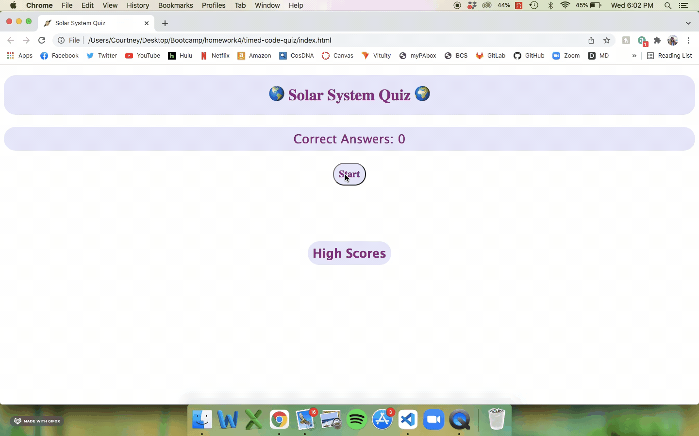
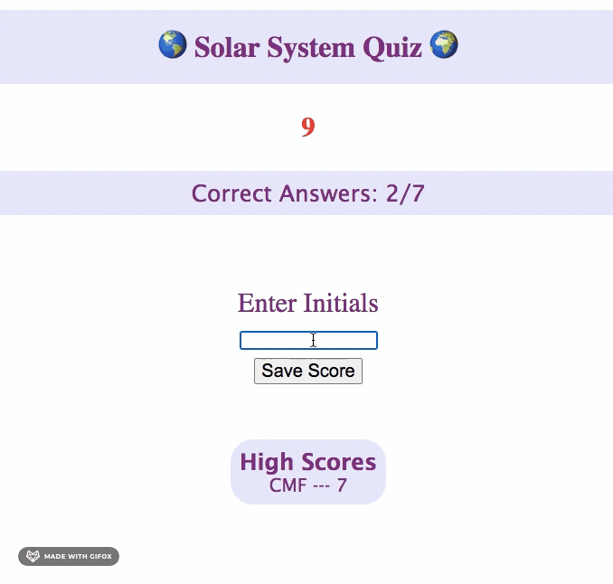

# Timed Quiz

User will enter the page to take a timed quiz and will be able to save their initials and score to the high score board. 

## Essential Code
* 
* 

### Installing

* Enter site
* Click start button
* Timer will appear and begin counting down from 30
* First question appears on page
* Answer each question
    * Incorrect answers deduct 10 seconds from timer
    * Ongoing score displayed above questions
    * If time runs out before questions are completed, user must start over
* After all questions have been answered, user is prompted to enter initials
* On page refresh, user initials and score will appear on score board along with other user initials and scores

## Built With

* [HTML](https://developer.mozilla.org/en-US/docs/Web/HTML)
* [CSS](https://developer.mozilla.org/en-US/docs/Web/CSS)
* [Javascript](https://developer.mozilla.org/en-US/docs/Web/JavaScript)

## Deployed Link

* [See Live Site](https://cfoster121.github.io/timed-code-quiz/)

## Author

**Courtney Foster** 

- [Link to Portfolio Site](https://cfoster121.github.io/homework2/)
- [Link to Github](https://github.com/cfoster121)
- [Link to LinkedIn](https://www.linkedin.com/in/courtney-foster-0b364575/)

## Acknowledgments

* [Icon Image](https://nineplanets.org/wp-content/uploads/2020/03/saturn.png)
* [W3 Schools](https://www.w3schools.com/)
* [MDN Web Docs](https://developer.mozilla.org/en-US/)
* [Gif Application](https://gifox.io/)
* [Markdown Preview](https://dillinger.io/)
* Slack study groups
* Tutor sesssions
